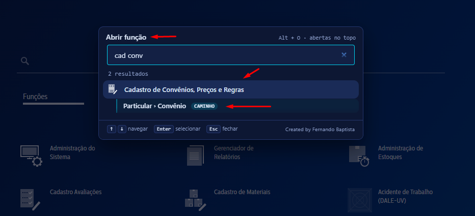
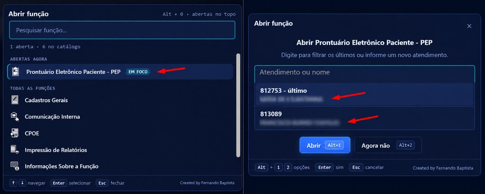
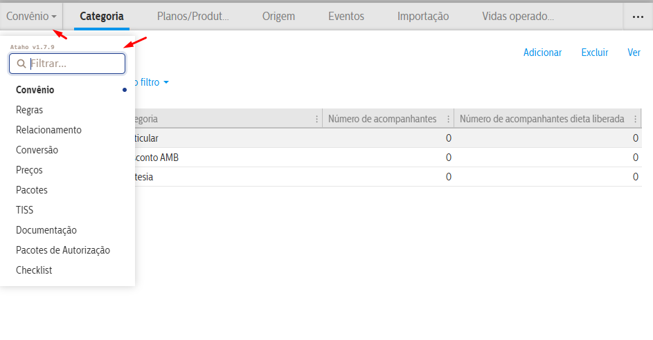
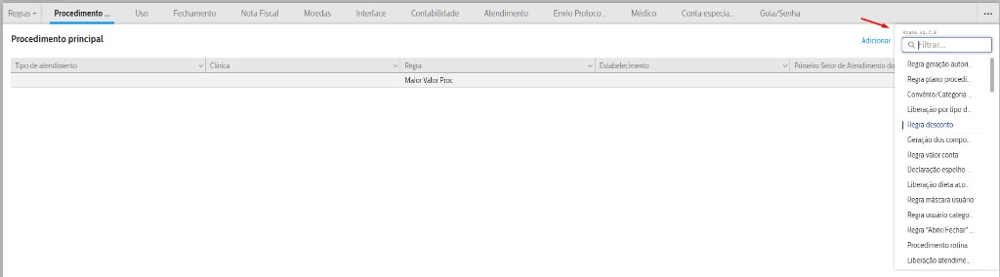
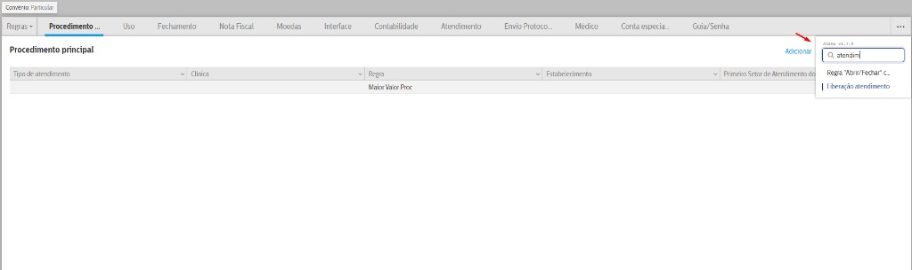
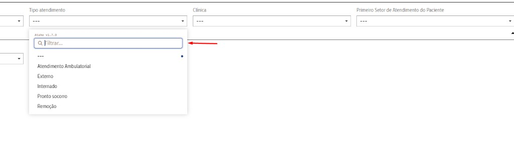
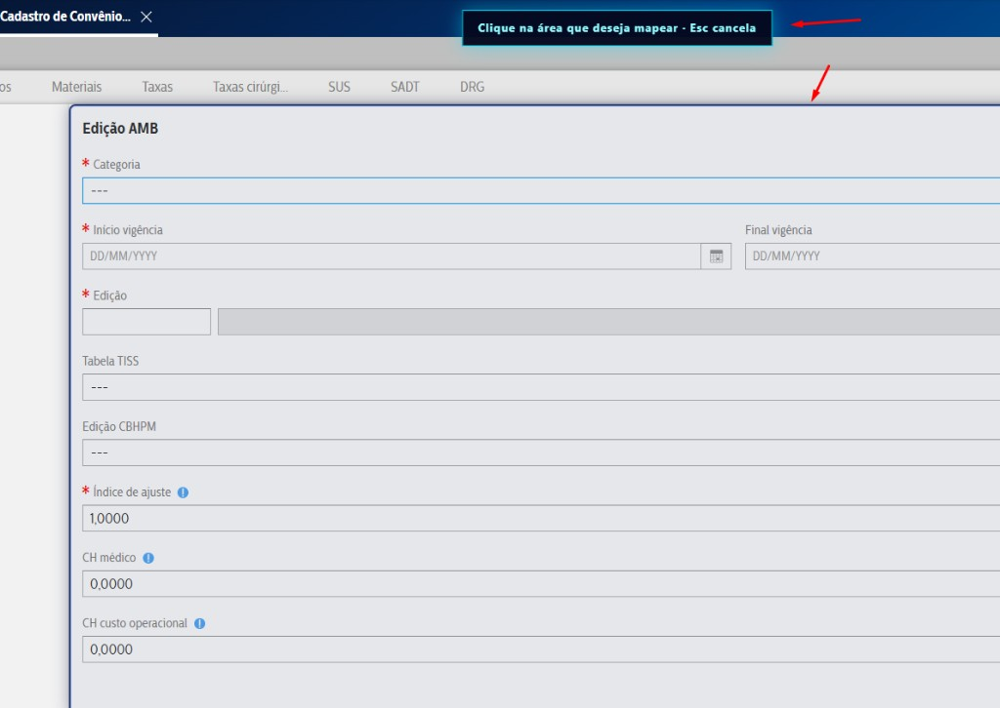
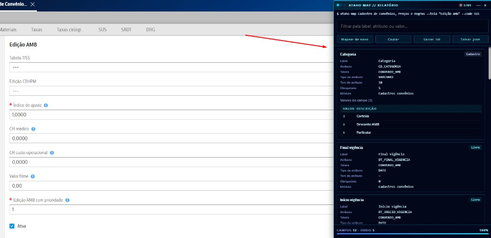
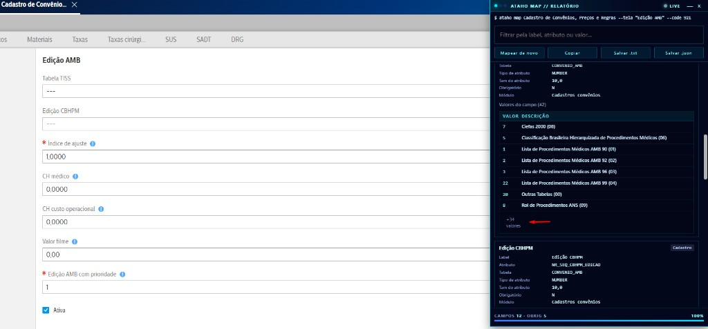
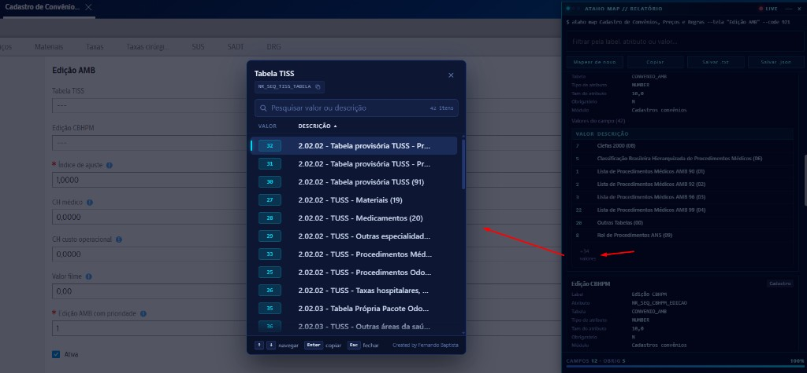

# Ataho

**Atalhos inteligentes para sistemas web.**

Extensão para Chrome que acelera o dia a dia no Tasy: troque de perfil, abra funções e volte exatamente para onde você estava, tudo pelo teclado.

  

> **Versão 1.7.10** · Projeto independente. Não é um produto oficial da Bionexo ou do Tasy.

## Download

| Versão | Para quem | Link |
| --- | --- | --- |
| **1.7.10 (mais recente)** | Quer as novidades abaixo | [Ataho.zip](https://github.com/fernandobaptistaneto/ataho/releases/latest/download/Ataho.zip) |
| **1.5.25 (estável)** | Prefere a versão mais testada | [Ataho.zip](https://github.com/fernandobaptistaneto/ataho/releases/download/v1.5.25/Ataho.zip) |

## Novidades da 1.7.10

- **Abrir função (Alt + O):** pesquise qualquer função liberada no seu perfil. As funções já abertas aparecem no topo.
- **Último filtro e último caminho no Alt + O:** embaixo de cada função aparece o último filtro que você aplicou e o último lugar em que estava (registro aberto, menu e abas). Selecione essa linha para abrir a função já filtrada e no mesmo lugar.
- **Troca de perfil volta para onde você estava:** ao trocar de perfil e escolher reabrir, o Ataho reabre a função, aplica o filtro, entra no registro, seleciona o menu e as abas em que você estava.
- **PEP com atendimento pelo Alt + O:** ao escolher o Prontuário Eletrônico do Paciente, o Ataho pergunta qual atendimento abrir e mostra os últimos que você usou. Dá para digitar um número novo ou filtrar pelo nome. Com o PEP já aberto, selecione-o de novo no Alt + O e escolha outro atendimento para trocar de paciente sem passar pelo Localizar Pessoas.
- **Atendimento do PEP na troca de perfil:** com um atendimento aberto no Prontuário Eletrônico do Paciente, ao trocar de perfil o Ataho reabre o PEP já no mesmo atendimento. Se o novo perfil não tiver acesso ao setor do paciente, aparece um aviso.
- **Mapear tela (Alt + M):** clique em uma área da tela e o Ataho lista todos os campos dela: label, atributo, tabela, tipo, tamanho, obrigatoriedade, valor atual e a lista de valores possíveis de cada campo. Dá para filtrar, copiar e salvar o relatório em .txt ou .json.
- **Trocar estabelecimento (Alt + I):** escolha a empresa e o estabelecimento pela paleta.
- **Busca nos menus e listas:** um campo **Filtrar** aparece no menu de navegação das funções, nos menus de três pontinhos e nos campos de seleção (select) dos filtros e dos formulários de cadastro. Dá para desligar no ícone da extensão.
- **Tela de carregamento própria** enquanto o Ataho aplica filtro e caminho, para você saber que ele está trabalhando.

## Atalhos

| Atalho | O que faz |
| --- | --- |
| **Alt + P** | Trocar perfil |
| **Alt + O** | Abrir função (com último filtro e caminho) |
| **Alt + I** | Trocar estabelecimento |
| **Alt + M** | Mapear os campos da tela |
| **Alt + 1**, **Alt + 2**... | Escolher a opção numerada nas perguntas da paleta |

Na paleta: **↑ ↓** navegam, **Enter** seleciona e **Esc** fecha.

> Se algum atalho não funcionar, ajuste em `chrome://extensions/shortcuts`.

## Instalação

1. Baixe o **Ataho.zip** (tabela acima) e extraia em uma pasta permanente.
2. Abra `chrome://extensions` em uma aba do Google Chrome.
3. Ative **Modo do desenvolvedor**.
4. Clique em **Carregar sem compactação** e selecione a pasta `ataho` (a que contém o `manifest.json`).
5. Abra o Tasy e pressione **Alt + P**. Na primeira vez, o Chrome pede para autorizar o endereço do Tasy.

### Atualizar para uma versão nova

1. Baixe o novo **Ataho.zip** e extraia por cima da pasta antiga (substituindo os arquivos).
2. Em `chrome://extensions`, clique no botão de recarregar do Ataho.
3. Atualize a página do Tasy (**F5**).

## Como usar

### Trocar perfil

1. Com o Tasy aberto, pressione **Alt + P**.
2. Digite parte do nome do perfil (acentos e maiúsculas não importam).
3. **Enter** para trocar. Se houver função aberta, escolha se quer reabri-la.
4. Se escolher reabrir, o Ataho volta para a mesma tela: filtro, registro aberto, menu e abas. Telas de cadastro com formulário aberto voltam para a grade, nunca para o formulário.

A função só é reaberta se estiver liberada no perfil de destino.

No **PEP**, o Ataho reabre o mesmo atendimento que estava aberto. Isso depende de o perfil de destino ter acesso ao setor do paciente; se não tiver, aparece um aviso e basta clicar na tela para fechá-lo.

### Abrir função

1. Pressione **Alt + O** e digite parte do nome da função.
2. **Enter** abre a função.
3. Se aparecer uma linha com a etiqueta **filtro** ou **caminho** embaixo da função (como **Particular › Convênio** na imagem), selecione essa linha: o Ataho abre a função e reconstitui o último caminho, com filtro, registro, menu e abas em que você estava.

#### PEP com atendimento

1. No **Alt + O**, escolha **Prontuário Eletrônico Paciente - PEP**.
2. O Ataho pergunta o atendimento: escolha um dos últimos da lista, digite parte do nome para filtrar ou informe um número novo.
3. **Abrir** (**Alt + 1**) abre o PEP já no atendimento escolhido. **Agora não** (**Alt + 2**) abre o PEP sem escolher atendimento (ou só traz o PEP para frente, se já estiver aberto).
4. Com o PEP já aberto (etiqueta **EM FOCO**), selecione-o de novo e escolha outro atendimento para trocar de paciente direto.

O Ataho guarda só o **último** filtro e caminho de cada função, separado por estabelecimento. Filtros que já vêm preenchidos pelo Tasy (como "Situação: Ativos") não contam.

### Trocar estabelecimento

1. Pressione **Alt + I**.
2. Escolha a empresa (se houver mais de uma) e depois o estabelecimento.

### Busca nos menus e listas

Ao abrir um menu ou uma lista do Tasy, o Ataho coloca um campo **Filtrar** no topo. Digite parte do texto (acentos e maiúsculas não importam) para encontrar a opção sem rolar a lista.

**Menu de navegação da função** (ex.: Convênio, Regras, Preços…):

**Menu de três pontinhos**, com todas as abas que não cabem na tela:

**Campos de seleção** nos filtros e nos formulários de inserção de dados:

A busca pode ser desligada em **Preferências**, no ícone do Ataho.

### Mapear tela

Mostra, para cada campo de uma tela do Tasy, as informações técnicas que normalmente exigem abrir o dicionário de dados: atributo, tabela, tipo, tamanho, obrigatoriedade e a lista de valores aceitos.

**1. Escolha a área.** Pressione **Alt + M**. Aparece o aviso **"Clique na área que deseja mapear"** e o Ataho destaca a área sob o mouse. Clique no formulário ou painel que quer mapear (**Esc** cancela).

**2. Leia o relatório.** O painel **ATAHO MAP // RELATÓRIO** abre ao lado, com um cartão por campo:

- **Label**, **Atributo** (ex.: `CD_CATEGORIA`), **Tabela** (ex.: `CONVENIO_AMB`), **Tipo de atributo**, **Tamanho**, **Obrigatório** (S/N) e **Módulo**.
- A etiqueta no canto do cartão indica o tipo do campo (ex.: **Cadastro**, **Livre**).
- Em **Valores do campo** aparecem os códigos aceitos e suas descrições (ex.: `1 - Particular`, `2 - Desconto AMB`).
- No rodapé, o total de campos mapeados e quantos são obrigatórios.

**3. Veja todos os valores.** Quando o campo tem muitos valores, o cartão mostra só os primeiros e, embaixo, um link como **+34 valores**. Clique nele para abrir a lista completa.

**4. Pesquise e copie na lista completa.** A janela de valores mostra o nome do campo (com botão para copiar o atributo), uma busca por **valor ou descrição** e a quantidade de itens. Ordene clicando em **Valor** ou **Descrição**, navegue com **↑ ↓**, copie o código com **Enter** e feche com **Esc**.

**5. Use o relatório.**

- **Filtrar pela label, atributo ou valor** encontra um campo rapidamente.
- **Copiar** manda o relatório para a área de transferência.
- **Salvar .txt / Salvar .json** baixa o relatório como arquivo, pelo download normal do Chrome.
- **Mapear de novo** volta para a seleção de área.
- O indicador **LIVE** acende enquanto o Ataho está lendo os campos; a barra no rodapé mostra o progresso. **—** minimiza e **×** fecha.

O mapeamento só lê a tela. Nada é alterado no Tasy.

## Privacidade

Tudo roda no navegador, na sessão que você já tem no Tasy. Não há servidor próprio, telemetria, nem coleta de senha, cookie ou token. O Ataho não grava nada no Tasy: só navega pela tela como você faria. As permissões de perfil e função continuam sendo as do Tasy.

O último filtro e caminho ficam salvos apenas no seu navegador. Em telas de atendimento ou paciente, o caminho completo fica só durante a troca de perfil e é apagado logo depois.

Este repositório publica o pacote de instalação. O código-fonte **não** é open source.

## Compatibilidade

Chrome e Tasy EMR. Telas e endpoints variam entre ambientes. Teste antes de usar em rotina crítica.

## Problemas e sugestões

Abra uma [issue](https://github.com/fernandobaptistaneto/ataho/issues) com a versão do Chrome, a versão do Tasy e o que aconteceu. **Não publique dados de pacientes, credenciais, tokens nem prints com informação sensível.**

---

Created by Fernando Baptista
